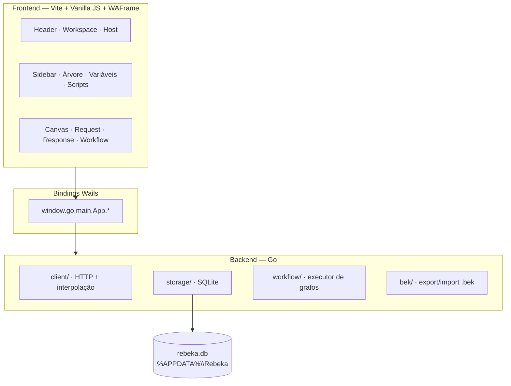

# REBEKA

> *"Enquanto o mundo discute REST vs GraphQL, ela só quer saber se o endpoint respondeu 200."*

**Rebeka** é um cliente HTTP desktop — o tipo de ferramenta que você abre às 23h para testar *aquela* rota que ninguém documentou. Inspirada na fluidez do Insomnia, construída com a robustez do Go e a leveza do Vanilla JS.

Sem abas infinitas no browser. Sem extensões estranhas. Só você, a API e um dark mode que respeita seus olhos cansados.

```
    ╔══════════════════════════════════════════════════════╗
    ║  R E B E K A                                         ║
    ║  ─────────────────────────────────────────────────   ║
    ║  Workspace  →  Host  →  Request  →  ✓ 200 OK  42ms   ║
    ╚══════════════════════════════════════════════════════╝
```

---

## Por que Rebeka?

| O problema | A resposta da Rebeka |
|------------|----------------------|
| "Qual era a URL de homologação mesmo?" | **Hosts** com `baseUrl` por ambiente — troca em um clique |
| "Preciso testar Local, Dev e Prod" | **Environments** com variáveis `{{base_url}}`, `{{token}}`… |
| "Minha coleção virou bagunça" | Árvore de **pastas e requests** na sidebar, escopada por host |
| "Quero automatizar 5 chamadas seguidas" | **Workflows** visuais — arraste, conecte, execute |
| "Perdi tudo depois do F5" | **SQLite embarcado** — tudo persiste automaticamente |
| "Preciso compartilhar com o time" | Exporta `.bek` — um ZIP elegante com todo o projeto |

---

## O que ela faz

### Cliente HTTP completo
- Métodos: `GET` · `POST` · `PUT` · `PATCH` · `DELETE` · `OPTIONS`
- Query params com toggle individual
- Body: JSON, Form-Data, URL-Encoded, Texto puro
- Headers + Auth (Bearer, Basic)
- Interpolação de variáveis em URL, headers e body: `{{minha_var}}`

### Resposta que você consegue ler
- Syntax highlight para JSON, XML e HTML
- Aba Raw para os corajosos
- Status, tempo (ms) e tamanho (bytes) sempre visíveis
- Headers de resposta copiáveis com um clique

### Variáveis de ambiente
- Múltiplos perfis por host (Local, Homolog, Prod…)
- Editor key/value integrado na sidebar
- Preview visual quando a variável é reconhecida e injetada

### Scripts & testes
- Pré-request: tokens dinâmicos, manipulação antes do envio
- Pós-request: extração de dados e asserções
- Resultados tabulares: **Passou** / **Falhou** logo abaixo da resposta

### Workflows visuais
- Canvas interativo — cada request é um nó
- Conexões com âncoras dinâmicas (arrastar e soltar)
- Execução sequencial ou paralela conforme o grafo
- Jobs agendados com histórico de execuções

### Formato `.bek`
Backup e compartilhamento via arquivo `.bek` — JSON estruturado empacotado em ZIP. Pense nele como o `.xd` das suas APIs: leve, portátil, seu.

---

## Arquitetura

Rebeka não é um Electron disfarçado. É **Wails** — Go nativo com WebView, frontend enxuto, persistência real.



### Hierarquia de dados

```text
Workspace
└── Host (Local, Develop, Homolog…)
    ├── Environment (perfil de variáveis)
    ├── tree_nodes (pastas + requests)
    │   └── requests (url = path relativo)
    └── workflows (grafos de automação)
```

**URL final no envio:** `host.baseUrl` + `request.url` + interpolação `{{var}}`

---

## Stack

| Camada | Tecnologia |
|--------|------------|
| Desktop shell | [Wails v2](https://wails.io/) |
| Backend | Go 1.24 |
| HTTP client | Pacote `client/` nativo |
| Persistência | SQLite (`modernc.org/sqlite`) |
| Frontend | Vite 6 + Vanilla JS (ES Modules) |
| UI framework | [WAFrame](https://github.com/) (componentes internos) |
| Estilo | CSS nativo — variáveis, flex, grid, dark mode |

---

## Estrutura do projeto

```text
/
├── main.go              # Entry point Wails
├── app.go               # Bindings expostos ao JS
├── client/              # Motor HTTP + interpolação de variáveis
├── storage/             # Schema SQLite, workspaces, hosts, envs
├── workflow/            # Executor de grafos
├── bek/                 # Export/import .bek
└── frontend/
    ├── src/
    │   ├── core/        # Store global, APP facade, orquestração
    │   ├── components/  # Sidebar, request-pane, workflow…
    │   ├── views/       # AppLayout (shell principal)
    │   └── utils/       # Formatadores, highlight, variáveis
    └── wailsjs/         # Bindings gerados (não editar)
```

---

## Como rodar

### Pré-requisitos

- [Go](https://go.dev/) 1.24+
- [Node.js](https://nodejs.org/) 18+
- [Wails CLI](https://wails.io/docs/gettingstarted/installation) v2
- WAFrame local em `C:/Applications/WAFrame-mod` (dependência do frontend)

### Desenvolvimento

```bash
# Instalar dependências do frontend
cd frontend && npm install && cd ..

# Modo dev (hot reload no frontend + Go)
wails dev
```

### Build de produção

```bash
wails build
```

O binário `rebeka` será gerado na pasta `build/bin/`.

---

## Atalhos mentais

| Ação | Onde acontece |
|------|---------------|
| Trocar workspace | Header → `#workspace-select` |
| Trocar host | Header → `#host-select` |
| Editar variáveis | Sidebar → **Variáveis** |
| Enviar request | Canvas → botão Send |
| Espelhar estrutura entre hosts | Host Manager → Mirror |
| Exportar projeto | Menu → Export `.bek` |

---

## Filosofia de código

- **Vanilla JS v1** — sem React/Vue. Um módulo por responsabilidade.
- **SOLID pragmático** — separação clara entre `storage/`, `client/` e UI.
- **Persistência centralizada** — se não está no SQLite, não existe.
- **WAFrame first** — modais via `APP.box`, botões via `WA.Show.button`, ícones via `WA.Icon`.

Documentação para **usuários** da ferramenta: botão **Documentação** no app (pasta [`docs/`](docs/)).

Documentação para **desenvolvimento**: [`.cursor/docs/system-map.md`](.cursor/docs/system-map.md)

---

## Roadmap (visão geral)

- [x] Workspaces, hosts e árvore de requests
- [x] Variáveis de ambiente por host
- [x] Cliente HTTP com auth e body types
- [x] Export/import `.bek`
- [x] Workflows visuais e jobs
- [ ] Scripts pré/pós-request (em evolução)
- [ ] Melhorias contínuas de UX

---

## Créditos

Concebido e desenvolvido por **Diogo**.

Inspirado na experiência do Insomnia, alimentado por café e endpoints que retornam `500 Internal Server Error` às vésperas de deploy.

---

<p align="center">
  <strong>REBEKA</strong> — porque toda API merece alguém que realmente escuta.<br>
  <sub>v0.1.0 · Go + Wails + SQLite · Dark mode included</sub>
</p>
